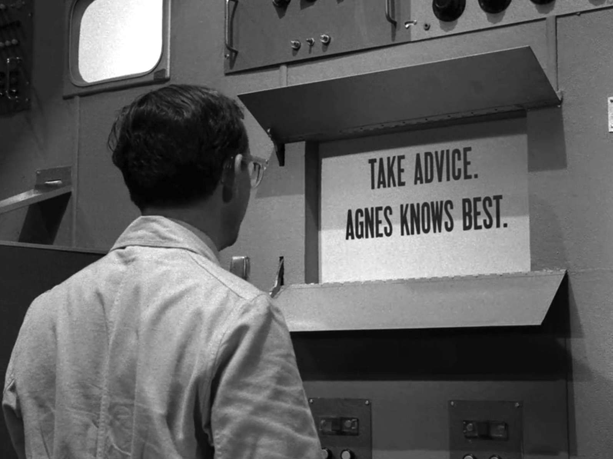

# Machine Learning

Includes all machine learning projects i've worked on, documenting my journey through machine learning.

</img>

## Reference

**Models**  
[Linear Regression](https://scikit-learn.org/stable/modules/generated/sklearn.linear_model.LinearRegression.html)  
[Logistic Regression](https://scikit-learn.org/stable/modules/generated/sklearn.linear_model.LogisticRegression.html)  
[Decision Tree Classifier](https://scikit-learn.org/stable/modules/generated/sklearn.tree.DecisionTreeClassifier.html)  
[Support Vector Machine](https://scikit-learn.org/stable/modules/generated/sklearn.svm.SVC.html)  
[Random Forest](https://scikit-learn.org/stable/modules/generated/sklearn.ensemble.RandomForestClassifier.html)  

**Tools**  
[Label Encoder](https://scikit-learn.org/stable/modules/generated/sklearn.preprocessing.LabelEncoder.html)  
[Train Test Split](https://scikit-learn.org/stable/modules/generated/sklearn.model_selection.train_test_split.html)  
[Heat Map](https://seaborn.pydata.org/generated/seaborn.heatmap.html)  
[Confusion Matrix](https://scikit-learn.org/stable/modules/generated/sklearn.metrics.confusion_matrix.html)  
[Keras](https://www.tensorflow.org/api_docs/python/tf/keras)  

**Datasets**  
[QuickDraw](https://quickdraw.readthedocs.io/en/latest/)  

<!---
  
--->

## Notes
Output, Input activation functions: Step function, Sigmoid, tanh.  
Hidden layer activation functions: ReLU, Leaky ReLU.  

